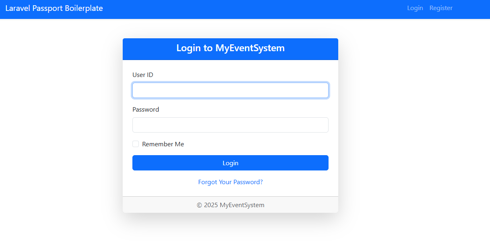
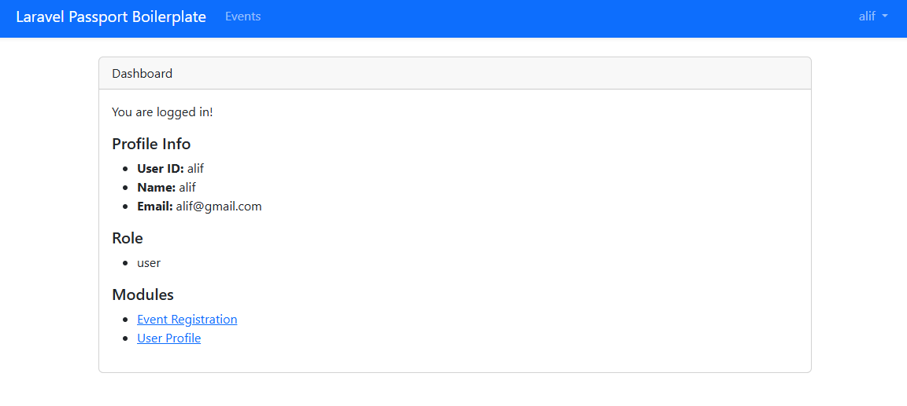

Project Name: [Insert Project Name]
Project Description
This is a secure web application built with the Laravel framework. The system focuses on robust user management, incorporating multi-role access control, secure file uploads, and advanced authentication layers to ensure data integrity and user privacy.
2. Installation Steps
Follow these steps to set up the project locally:

Clone the repository:
git clone
cd danish

Install PHP dependencies:
composer install
npm install && npm run dev
Configure Environment: Copy .env.example to .env and update your database credentials.

Initialize Passport Security:
//to implement passport in our system
php artisan key:generate
php artisan passport:install

3. Security Features Summary
MFA (Multi-Factor Authentication): Enhanced login security via Google Authenticator or SMS codes.

Role-Based Access Control (RBAC): Managed via Spatie/Laravel-Permission to restrict access based on user roles (Admin, User, etc.).

Force HTTPS: SSL/TLS enforcement in the AppServiceProvider to encrypt data in transit.

Policy Protection: Using Laravel Policies to authorize specific actions on models.

4. How to Run the App
To start the local development server:
php artisan serve

If you make changes to configurations or routes, clear the cache using:
php artisan optimize:clear

5. Dependencies
Framework: Laravel

Authentication: Laravel Passport

Permissions: Spatie Laravel-Permission

Frontend: Laravel Mix / Webpack

6. Screenshot(s) of system

